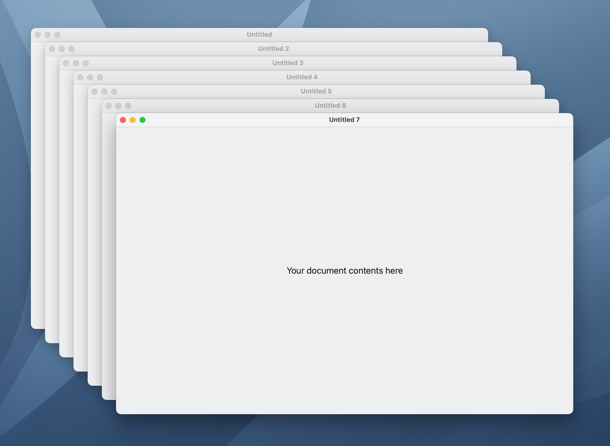
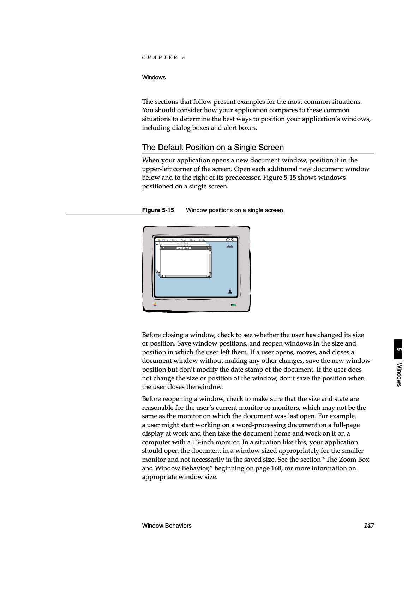
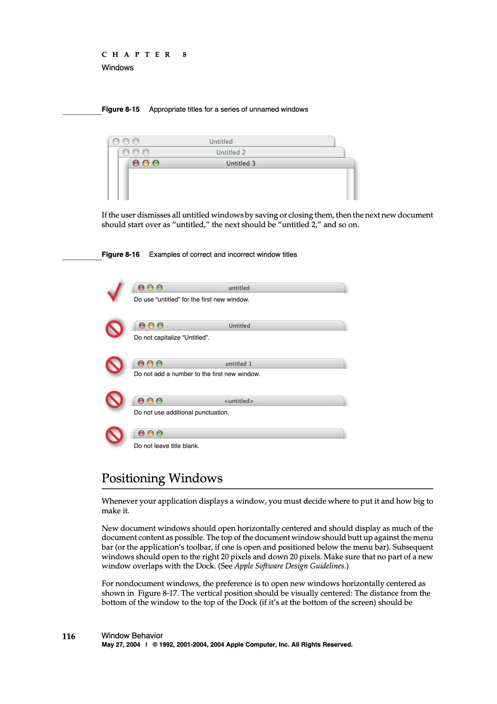

# WindowCascading

A protocol extension for NSWindowController that easily to add natural window cascading feature. This avoids some AppKit buggy behaviors.



## Why?

Window cascading has long been an excellent Mac feature because it eliminates some of the inconvenience of our windowing experience. However, it works inexplicably strange in modern macOS, and developers seem to have more difficulty controlling it than one might imagine.




*Macintosh Human Interface Guidelines 1992, p.147 / Apple Human Interface Guidelines 2004-03-27, p.116*

---

- [`NSWindowController.windowFrameAutosaveName`](https://developer.apple.com/documentation/appkit/nswindowcontroller/1528616-windowframeautosavename) seems to break window cascading.

- [`NSWindow.cascadeTopLeft(from:)`](https://developer.apple.com/documentation/appkit/nswindow/1419392-cascadetopleft) returns unnatural coordinates.

- Due to the complexity of the NSWindow lifecycle, it is difficult for us to determine when a window size should be determined.

- [`NSWindowController.showWindow(_:)`](https://developer.apple.com/documentation/appkit/nswindowcontroller/1534037-showwindow) and [`NSWindow.makeKeyAndOrderFront(_:)`](https://developer.apple.com/documentation/appkit/nswindow/1419208-makekeyandorderfront) are not called under the [NSWindowRestoration](https://developer.apple.com/documentation/appkit/nswindowrestoration) mechanism. It is necessary to properly grab the timing when the window is displayed.
	- To know when a window is restored, we need to monitor [`NSApplication.didFinishRestoringWindowsNotification`](https://developer.apple.com/documentation/appkit/nsapplication/1526252-didfinishrestoringwindowsnotific). In other words, there are at least two triggers a window appears, and it is important to keep a proper watch on these.


## First Step

Paste the following code into your WindowController implementation or subclassing from CascadableNSWindowController:

```swift
import WindowCascading

 var usesPersistentCascadableWindowFrame: Bool {
	true
 }
 var discardsPersistentCascadableWindowFrameWhenLastClosed: Bool {
	false
 }
 var resetsFrameWhenCascadableWindowRestored: Bool {
	true
 }
 var centerCascadableWindowPositionWhenFirstOpening: Bool {
	false
 }
 var cascadableWindowFrameAutosaveName: String {
	"Document"
 }

static var previousTopLeft: NSPoint?

func targetCascadableWindows() -> [CascadableWindow] {
	// You must manage target windows
	// This line is valid if you are using the NSDocument-based window architecture
	NSDocumentController.shared.cascadableWindows()
}

func defaultCascadableWindowSize() -> NSSize? {
	// Return the default window size if necessary
	nil
}

override func windowDidLoad() {
	super.windowDidLoad()
	
	// Setup window cascading (for NSWindowRestoration)
	prepareForWindowRestoring()
}

override func showWindow(_ sender: Any?) {
	super.showWindow(sender)
	
	// Setup window cascading
	setupWindowCascading()
}
```

## Usage

- Make your subclass of NSWindow to conform to `CascadableWindow` protocol.
- Make your subclass of NSWindowController to conform to `WindowControllerWithCascading` protocol or subclassing it from `CascadableNSWindowController`.
- Implement `targetCascadableWindows()` in your WindowController.
- Call `prepareForWindowRestoring()` method in `windowDidLoad()` of your WindowController implementation.
- Call `setupWindowCascading()` method in `showWindow(_:)` of your WindowController implementation.
- Implement `defaultCascadableWindowSize()` in your WindowController if necessary.


## Customize

- `usesPersistentCascadableWindowFrame: Bool`
	- Specifies whether the window coordinates after cascading should be saved in UserDefaults.
- `discardsPersistentCascadableWindowFrameWhenLastClosed: Bool`
	- Specifies whether to delete the saved window frame from the UserDefaults when the last window is closed.
- `resetsFrameWhenCascadableWindowRestored: Bool`
	- NSWindowRestoration support. Reset the cascadable window’s frame when it’s restored.
- `centerCascadableWindowPositionWhenFirstOpening: Bool`
	- Specifies whether to center the position of the first window when it opens.
- `cascadableWindowFrameAutosaveName: String`
	- Return the unique name for AutosaveName (do not include the string "window" because of a bug in AppKit).
- `targetCascadableWindows() -> [CascadableWindow]`
	- Return your managing CascadableWindow instances.
- `defaultCascadableWindowSize() -> NSSize?`
	- Return any initial window size if you want.

## Note

It seems that calling [`shouldCascadeWindows = true`](https://developer.apple.com/documentation/appkit/nswindowcontroller/1528177-shouldcascadewindows) in `windowDidLoad()` is too late:
[https://stackoverflow.com/questions/35827239/document-based-app-autosave-with-storyboards/43726191](https://stackoverflow.com/questions/35827239/document-based-app-autosave-with-storyboards/43726191)

However, this is true by default, so there is no need to mention it if you are cascading.

- It seems that cascading does not work properly when **"window"** text is included in AutosaveName.
- To begin with, it seems that using `NSWindowController.windowFrameAutosaveName` causes the window to be out of position?

So, based on the reference information, I decided to adopt a policy to achieve cascading and frame saving without using `NSWindowController.windowFrameAutosaveName`.
This is handled by directly reading and writing UserDefaults with **"NSWindow Frame FOOBAR"** as the key.

Refs:

- https://github.com/coteditor/CotEditor/blob/f9c140ab08fd6acd24ebe65fd01420f29ba367fd/CotEditor/Sources/DocumentWindowController.swift
- https://github.com/jessegrosjean/window.autosaveName/blob/master/Test/WindowController.m
- https://stackoverflow.com/questions/35827239/document-based-app-autosave-with-storyboards/43726191

